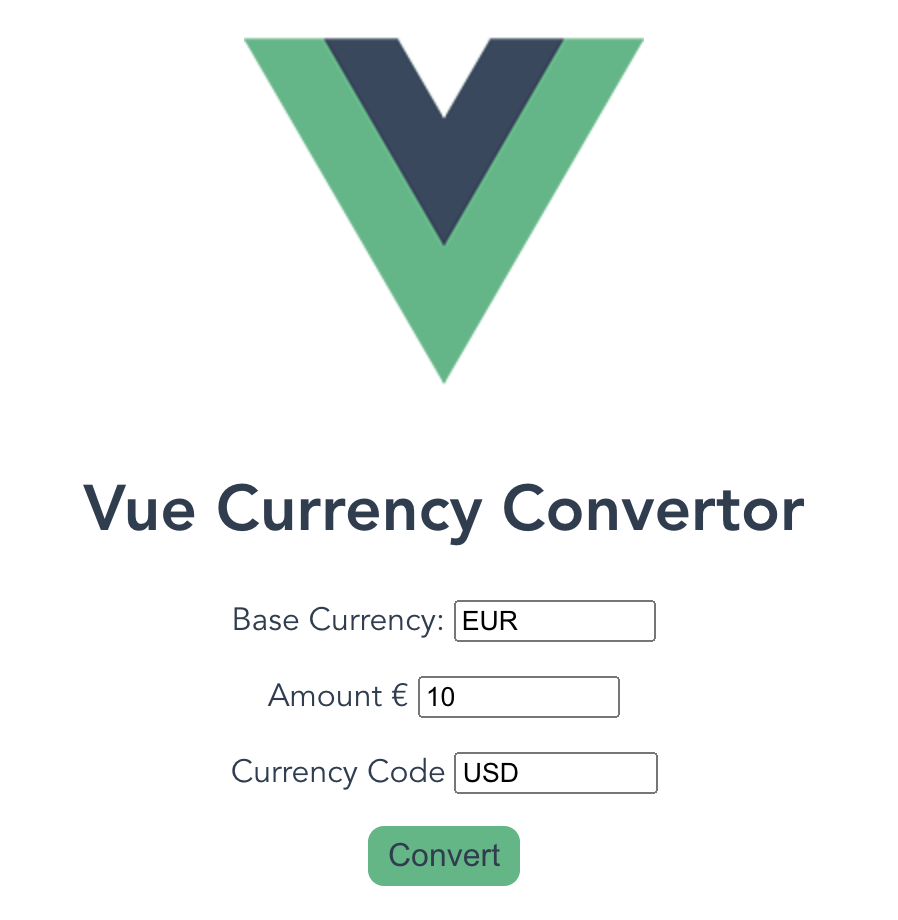

# vue_currency_convertor_component

Simple Currency Convertor using EUR as a base.

Next steps will be to make it possible to select which currency you want to have as base.

- Source: http://api.exchangeratesapi.io 
- Technologies used: Vue, Axios

Demo screenshot below:



<br>
<br>

## Styling

Styling is simple and clean on purpose, the main point here is functionality. Once all functionality has been added, then the styling will be improved.

## Project setup
```
npm install
```

### Compiles and hot-reloads for development
```
npm run serve
```

### Compiles and minifies for production
```
npm run build
```

### Lints and fixes files
```
npm run lint
```

### Customize configuration
See [Configuration Reference](https://cli.vuejs.org/config/).
